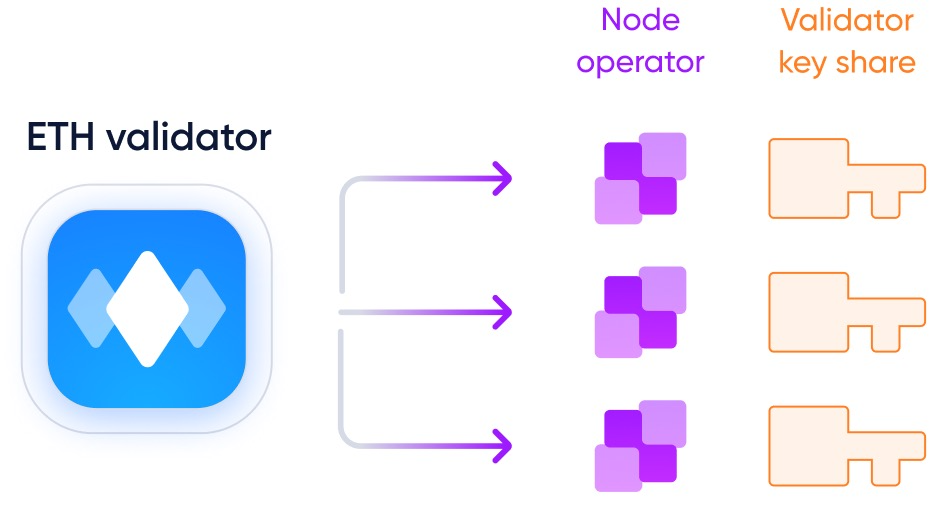
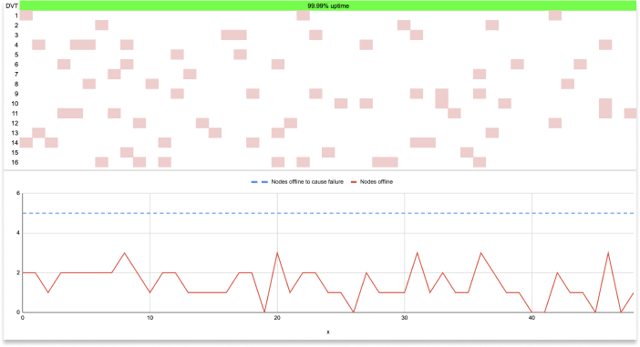

# Distributed Validation

## How does Diva's DVT work?

Diva uses Distributed Key Generation (DKG) to split private validator keys into key-shares operated by separate nodes using BLS threshold signatures. Key shares are generated with state-of-the-art Multi-Party Computation (MPC) so private keys never come together.

### How are new keys distributed between operators?

Operators are assigned to new validators in a stochastic but fair process which ensures a uniform distribution of duties across the network. 

### How does Diva's DVT compare to SSV and Obol?

Diva's DVT is deeply integrated with its Liquid Staking economic system. It has built-in mechanisms to reward good actors while ejecting bad actors. Its rotational nondeterministic consensus has 2x lower latency than classic DVT. 

Diva's Distributed Validation Technology (DVT) is designed to ensure the integrity and security of the Ethereum validators operated via Diva.

With its fault tolerance and consensus mechanisms, Diva’s DVT system prevents single Operators from causing damage, while enabling uninterrupted operation even with some nodes offline.

## Key Features

1. **Node Fault Tolerance**: Diva's DVT uses innovative risk mitigation methods to prevent single Operators from causing damage. By employing robust fault tolerance and consensus mechanisms, DVT ensures that the network remains secure and operational.
2. **Threshold Signature Consensus**: To maintain security and efficiency, the DVT system requires 11 out of 16 key shares in order to sign validation duties. This ensures that the network remains resilient even if a few nodes are offline.
3. **Validator Attestation Duties**: Validators in the DVT system receive attestation duties every few minutes. Correctly fulfilling these duties generates rewards for the validators, while missed duties result in penalties. If a validator sends a malicious message, it is slashed and forced to withdraw from the network.
4. **Offline Operator Tolerance**: Diva's DVT system can tolerate up to 5 Operators being offline without causing downtime. This is because only 11 out of 16 (2/3rd) key shares are required to sign validation duties, allowing the network to remain operational even with a few nodes offline.
5. **Improved Performance**: As an example, consider a set of nodes with 5% downtime each. When incorporated into a Diva committee, the resulting downtime would be less than 0.01%. This is a significant improvement compared to the typical single-node operator, showcasing the resilience and reliability of the DVT system.
6. **Optimized for Low Latency.** Diva’s DVT allows distributed nodes to fulfill attestations with only one round trip, instead of requiring multiple messages back and forth, resulting in lower response times and better overall performance. The performance of a Diva validator is as good as the performance of a classic validator.

With its fault tolerance and consensus mechanisms, offline Operator tolerance, and improved downtime metrics, the DVT system offers a robust and reliable option for maintaining network performance and security.

**Diva's DVT turns a set of 16 nodes with 95% uptime into a Distributed Validator with 99.99% uptime**

