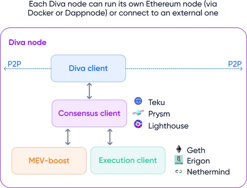

# Testnet Operator Guide

Diva is Ethereum’s first Liquid Staking solution powered by Distributed Validators (DVT)

:::info
Diva is on the road to mainnet! [Check the Roadmap](roadmap) for the latest details. ⚡️
:::

## Running a node

### What is a Node Operator on the Ethereum network?

A node operator on the Ethereum network plays a crucial role in maintaining the network's security and stability by running an Ethereum node.

Each node stores a copy of the blockchain ledger, validates transactions, and participates in the consensus process, ensuring only legitimate transactions are added to the blockchain.

### How is a Diva node different?

**A Diva node is a modified version of an Ethereum node, connecting it to Diva's Liquid Staking, DVT and economic guarantees model.**

A Diva Operator is responsible for maintaining their node's hardware and software updates, monitoring its performance and security.

Operators are essential to the effective functioning of the Ethereum and Diva networks, and they are rewarded for their contribution with staking rewards.

## Diva’s Node requirements

There are two ways to run a Diva node:

1. **A full Diva node**. This requires a server with the capacity to run a full Ethereum node (including EL/CL clients).
  - 🤖 CPU: 4 cores minimum, 8 cores recommended.
  - 🧠 RAM: 4 GB minimum 8 GB recommended.
  - 🍱 Hard drive: 2 TB SSD drive.
  - Recommended: Wired internet connection
2. **Connecting Diva to an existing Ethereum node**. In this case the requirements are much lower, as the Ethereum node does all the heavy lifting. It is recommended to use a dedicated Ethereum node that's isolated from other services to avoid accidental failures.

### Next step: Testnet launch

It is expected that Operators will require a minimum of 1 ETH per key share to operate a validator node.

[Check the Roadmap](roadmap) for the latest details, and get involved!

