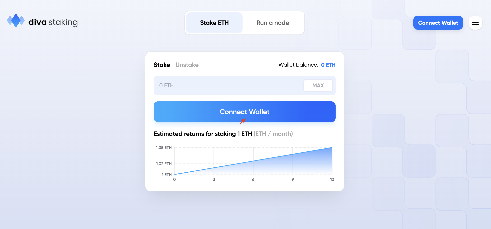
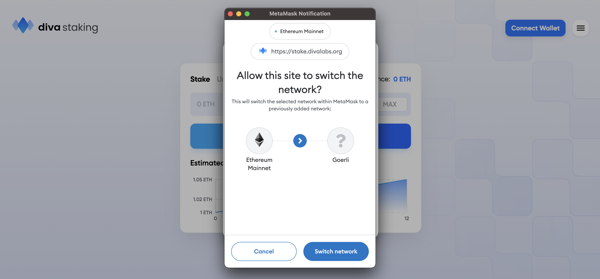
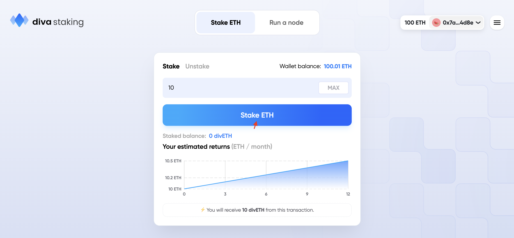
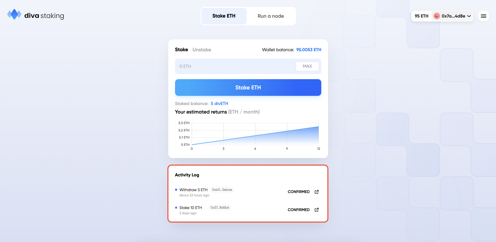

# Testnet Staking Guide

:::info

Diva Staking is currently only available in Testnet! Please be aware as Diva is on the road to mainnet to not lose actual ETH. Diva may be impersonated, so make sure to only stake on https://stake.divalabs.org.
:::

In this guide, you will find how to stake with Diva, and learn how your ETH can secure Ethereum while earning rewards automatically.

#### Before continuing: 
 - To learn about staking rewards and more please visit
[Staking Economics](econ_rewards.md)
 - To learn about the divETH token and all its mechanisms, please visit [divETH & wdivETH](04-lst.md)
 - To learn about the features of the divETH token, please visit [Features](03-features.md)

## How to Stake 
(Will add a loom video)

### Directly on the staker web interface

Staking by the web interface:
- Easiest way to stake
- underlying SCs work
- The main benefit is that you know for sure that divETH/ETH is always 1:1, no extra fee  whatsoever but the disadvantage is that the transaction cost (gas) might be very expensive regardless the ETH you deposit so for small amounts this may not be the best option.  

## 💠 Step-by-step Guide to Staking

1. Go to **[https://stake.divalabs.org/](https://stake.divalabs.org/)**

    

2. Hit the big blue button to connect your preferred wallet, and you will be prompted to switch to the Goerli test network if you are not already connected. 🟢
    

3. Enter the amount of Goerli you would like to stake on Diva's testnet, and click "Stake ETH".

1.  **Congratulations! You just staked with Diva!** You can view your transaction in the activity log

By holding divETH, you are automatically earning staking rewards.

#### Unstaking
(Will add a loom video)

- Install Metamask if you haven't already and switch to Goerli Test Network
- Add the divETH token to Metamask in order to see your balance. 
- Go to https://stake.divalabs.org 
- Change from "Stake" to "Unstake" at the top of the staking box
- Now, all that's left to do is enter the amount you would like to withdraw, and click the big blue "Unstake" button!
    - Confirm the transaction in Metamask.
    - When confirmed the transaction will go through and when completed the divETH balance in your wallet will be updated. 

Note: Trading divETH back for ETH is only possible when the staking liquidity pool has enough ETH in it to handle your trade. Otherwise an exit needs to be performed. So the withdrawal is guaranteed but not immediately. 

To learn where rewards come from, go to [Staking Economics](docs/staker_faq.md) ⇒ Ethereum Rewards.

The source of the ETH is from both Stakers and Operators. 

#### Swapping for divETH via Balancer

(Maybe a just a video is easier)

rp says:
Once your wallet is set up and funded, head to this URL which will open Balancer and 
automatically show swapping ETH for divETH∫:
Click on the Connect wallet button in the top-right corner. You will be prompted with a 
screen that asks you which wallet provider you want to use. For this example, select 
MetaMask.

If you're not using MetaMask, one of the other providers such as WalletConnect will likely 
be compatible with your wallet.

Upon clicking that button, MetaMask will pop up with a prompt asking you to select which 
accounts you want to use. Assuming you only have one, your account should already be 
selected. Click Next.

It will then ask if you would like to give Balancer access to view the addresses of your 
accounts:

Click Connect and after a brief pause window, your wallet will be connected to Balancer. 
You should now see its ETH balance in the top left side of the screen.

Now, enter the amount of ETH you want to swap and Balancer's UI will show you the amount 
of divETH you will receive in return:

NOTE

Click Preview to see the details of the trade, including the minimum amount
 you could receive due to slippage. If you're satisfied, click Confirm trade. 
 This will send the request to MetaMask, where you can review the total transaction 
 cost before confirming it

Pay close attention to the estimated gas fee here, highlighted in red. If it's a significant amount of your overall transaction (here it's over 17%), then it will take a very long time before you break even on staking rewards.
If this is the case, you should either wait for the network's average gas price to drop, or consider using a Layer 2 solution instead.
If you are happy with the gas fees relative to the total amount of divETH you'll be receiving, click Confirm to submit the transaction. After a short period, you should see a notification from MetaMask that it completed successfully, and you will now see the divETH token in your wallet.
That's it! You're now staking with Rocket Pool. All you need to do is hold onto your divETH, and you'll automatically gain your staking rewards as the value of the divETH token increases.

#### Swapping for divETH via Uniswap
(Maybe a just a video is easier)

similar to RP's message:

While we recommend you stake through Balancer because it has lower fees and a 
more accurate ETH-divETH rate, you can also swap for divETH via Uniswap if the need arises.
 Head to this URL which will open Uniswap and automatically show swapping ETH for divEHT:

This is just a temporary warning until Uniswap adds divETH to its canonical token list. 
As long as the token address is xxx, 
you can add it safely.

Click on one of the Connect Wallet buttons such as the highlighted one in the top-right corner. You will be prompted with a screen that asks you which wallet provider you want to use. For this example, select MetaMask.

NOTE

If you're not using MetaMask, one of the other providers such as WalletConnect 
will likely be compatible with your wallet.

Upon clicking that button, MetaMask will pop up with a prompt asking you 
to select which accounts you want to use. Assuming you only have one, your account 
should already be selected. Click Next.

It will then ask if you would like to give Uniswap access to view the addresses 
of your accounts:

Click Connect and after a brief pause window, your wallet will be connected to Uniswap.
 You should now see its ETH balance in the top right corner of the screen.

Now, enter the amount of ETH you want to swap and Uniswap's UI will show you the amount
of divETH you will receive in return:

NOTE

Click Swap to see the details of the trade, including the minimum amount you could 
receive due to slippage. If you're satisfied, click Confirm Swap. This will send the 
request to MetaMask, where you can review the total transaction cost before confirming it:

NOTE

Pay close attention to the estimated gas fee here, highlighted in red. If it's a significant amount of your overall transaction (here it's over 17%), then it will take a very long time before you break even on staking rewards.
If this is the case, you should either wait for the network's average gas price to drop, or consider using a Layer 2 solution instead.
If you are happy with the gas fees relative to the total amount of divETH you'll be receiving, click Confirm to submit the transaction. After a short period, you should see a notification from MetaMask that it completed successfully, and you will now see the divETH token in your wallet.
That's it! You're now staking with Rocket Pool. All you need to do is hold onto your divETH,
 and you'll automatically gain your staking rewards as the value of the divETH token increases.

### Using a DEX on L2

TBD - NA for now
Arbitrum
Polygon PoS?
